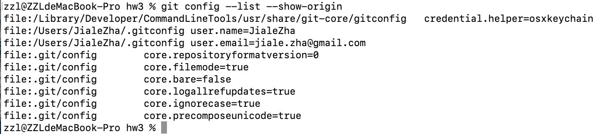
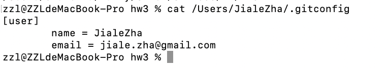
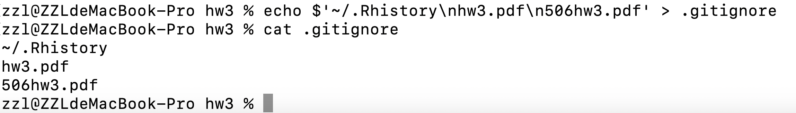
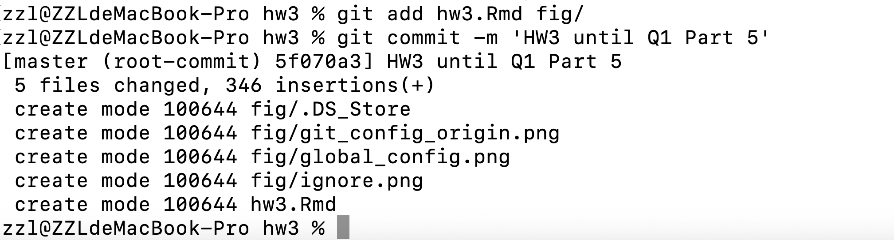
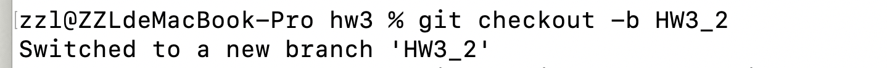
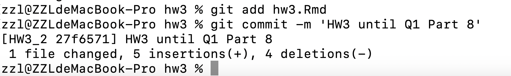
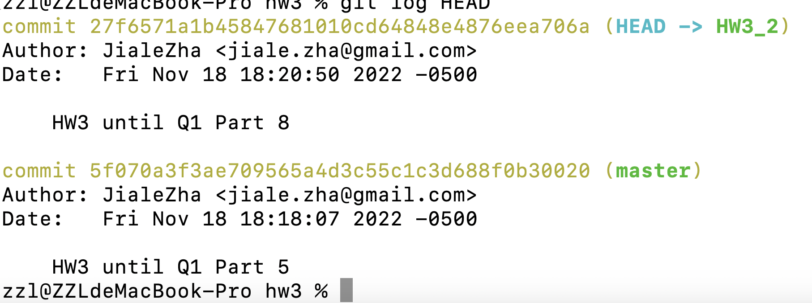

```{r setup, include=FALSE}
knitr::opts_chunk$set(echo = TRUE)
library(dplyr)
library(RMySQL)
library(readxl)
library(sf)
library(tidycensus)
library(tigris)
library(tidyverse)
library(stringr)
library(lme4)
```

# Question One

## Part (1)
I'm using a Mac, so could complete the work from my terminal. 

### Git Initialization 
First of all, in the terminal, we change the current directory to the *`hw3`* folder and then, use the command `git init` to initialize this folder as a Git project. 

### Path to Git Configuration File
Basically, we use the command `git config --list --show-origin` to list all the Git configuration files and their directories. The result is shown in the Figure 1 below. 



### Global Git Configuration


We could see that the **global level configuration file** is located at '`/Users/JialeZha/.gitconfig`', while the **project level one** is located at a subfolder of current directory '`.git/config`', whose absolute path should be '`/Users/JialeZha/Daily/Umich/STAT506/hw/hw3/.git/config`'. 

The add of user name and email to the global configuration could be completed through commands `git config --global user.name JialeZha` and `git config --global user.email jiale.zha@gmail.com`. Since we have set that before, we do not execute them again. 

To dsiplay the global configuration file, we could use the `cat` command, the result is shown in the Figure 2 above.

### Gitignore

We use the command `touch` and `echo` to create the .gitignore file and write the path to .Rhistory files into it. The result is shown in the following Figure 3



## Part (2)

The function for reading data and creating dataframe is in the following chunk, basically, we just need two parameters `skip` and `nrows` of `read.table()` function to control the rows we want to read. We also paste the FIPS code and census tract code together for each census tract to get the unique their tract code.
```{r}
read_business_academic <- function(n1, n2) {
  col_name <- read.table('data/2020_Business_Academic_QCQ.txt', 
                               sep=',', quote="\"", nrows=1, header=TRUE) %>%
    colnames()
  academic_table <- read.table('data/2020_Business_Academic_QCQ.txt', 
                               fileEncoding="latin1", sep=',', quote="\"", 
                               skip=n1, nrows=n2 - n1, header=FALSE,
                               colClasses = rep('character', length(col_name)))
  
  colnames(academic_table) <- gsub('\\W+', '_', col_name) %>% tolower()
  
  cols <- c('state', 'county_code', 'employee_size_5_location', 
            'sales_volume_9_location', 'census_tract')
  
  academic_table$census_tract <- paste(academic_table$fips_code,
                                       academic_table$census_tract, sep="")
  
  numeric_field <- c('employee_size_5_location', 
            'sales_volume_9_location')
  academic_table[, numeric_field] <- sapply(academic_table[, numeric_field], 
                                            as.numeric)
  return(academic_table[, cols] %>% na.omit())
}
```

## Part (3)

In the following chunk, we use `for` loop to read records in small batches and combine them together. 
```{r}
business_academic_table <- data.frame()
for (i in 0:14) {
  business_academic_table <- business_academic_table %>% 
    rbind(read_business_academic(20000*i + 1, 20000*(i + 1) + 1))
}
business_academic_table 

```


The `df1` table could be generated through the `group_by` operation as shown in the chunk below. 
```{r}
df1 <- business_academic_table %>% 
  group_by(census_tract) %>%
  summarise(employee_size=sum(employee_size_5_location),
            sales_volume=sum(sales_volume_9_location))
df1
```

## Part (4)

```{r echo=FALSE}
db_password <- 'Zha176089'
```

### Connect to MySQL
We use the library `RMySQL` to connect our R studio to MySQL, this could be done by the following three lines of code. Note that, we exclude the password variable for security reason. 
```{r}
mysqlconnection = dbConnect(RMySQL::MySQL(), host='localhost', port=3306,
                            user='root', password=db_password)
db_connect = dbConnect(mysqlconnection)
```

### Create Database
The creation of database `Hw3db` could be realized through the `dbSendQuery()` function. 
```{r eval=FALSE}
create_db_query <- "CREATE DATABASE Hw3db"
db_result <- dbSendQuery(db_connect, create_db_query)
dbClearResult(db_result)
```

### df1 Table
Have created the database, we reconnect to the MySQL server and specify the database we want to use. Then we write a query to create the `df1` table to hold our dataframe `df1`.
```{r eval=FALSE}
mysqlconnection = dbConnect(RMySQL::MySQL(), host='localhost', port=3306,
                            user='root', password=db_password, dbname='Hw3db')
db_connect = dbConnect(mysqlconnection)

create_table_query <- "CREATE TABLE df1 (
                          census_tract char,
                          employee_size int,
                          sales_volume int
                        )"
table_result <- dbSendQuery(db_connect, create_table_query)
dbClearResult(table_result)
```

Function `dbWriteTable()` could help us load the R dataframe to MySQL table. 
```{r}
dbWriteTable(db_connect, 'df1', df1, overwrite=TRUE)
```

## Part (5)
We display the result of query through `dbGetQuery()` function, as shown below. 
```{r}
top_sales_query <- "SELECT census_tract, sales_volume 
                    FROM df1 
                    ORDER BY sales_volume DESC
                    LIMIT 10"
top_sales <- dbGetQuery(db_connect, top_sales_query)
top_sales 
```

## Part (6)
The commit could be made by command `git commit`, we use the following command to make it along with a message. Notice, that given we execute the sql query in R, the only thing we want to track by git is this Rmd file and its figures, so we only add them to git. 

`git add hw3.Rmd, fig/`
`git commit -m 'HW3 until Q1 Part 5'`

The result of commit is shown in the following Figure 4



To create and switch to a new branch, the command `git checkout` is useful, as shown in the next line. 

`git checkout -b HW3_2`




## Part (7)

### Field Name
We first read the associated data to find reasonable name of those fields. 
```{r}
field_name_table <- read_xlsx('data/historicalconsumerlayout.residential.xlsx',
                              skip=1)
field_list <- c("FIELD19", "FIELD20", "FIELD22", 'FIELD45', 'FIELD64', 'FIELD65')
field_name_table[field_name_table$`Header Field Name` %in% field_list, ]
```

### Script to Extract Data
The following chunk of code displays the function we use to extract house data. We source it to a script called `load_house_data.R`, so won't execute the following chunk.
```{r eval=FALSE}
field_name <- c('household_wealth', 'household_income', 'home_valuation',
                'state', 'county_code', 'census_tract')

field_list <- c("FIELD19", "FIELD20", "FIELD22", 'FIELD45', 'FIELD64', 
                'FIELD65')

load_house_data <- function(path) {
  house_table <- read.csv(path, nrows=-1)[, field_list]
  colnames(house_table) <- field_name
  
  house_table$census_tract <- as.character(house_table$census_tract) %>%
    str_pad(5, side='left', pad='0')
  
  return(house_table[house_table$home_valuation != 0, ])
}
```


### Extract Data
Then, we use the function in the script and load the house data.
```{r}
source('load_house_data.R')
house_table <- load_house_data('data/AL.csv')
```

### Summarize Statistics
The `df2` table could also be gotten by the `group_by()` function as shown below.
```{r}
df2 <- house_table %>% 
  group_by(census_tract) %>%
  summarise(household_income=sum(household_income),
            household_wealth=sum(household_wealth),
            home_valuation=sum(home_valuation))
df2
```


## Part (8)
The import of `df2` to MySQL could be done by `dbWriteTable()` function. 
```{r eval=FALSE}
dbWriteTable(db_connect, 'df2', df2, overwrite=TRUE)
```

## Part (9)
Until now, we have change this Rmd file, so only need to add this file. The commit command is shown in the next line. 

`git add hw3.Rmd`

`git commit -m 'HW3 until Q1 Part 8'`



The `git log` command will display our history information of commit, and the `HEAD` parameter means we track the history information from the very beginning. 

`git log HEAD`


## Part (10)

### Census API Key
To get the census data, we just do the same thing as we did in HW2. First, set up the `census_api_key` and find the state code for Alabama. 
```{r}
census_api_key('4b219ac6667bd109a2b29199c753dc2cdd268da7', install = TRUE,
              overwrite=TRUE) 
readRenviron("~/.Renviron")
print(lookup_code(state = 'Alabama'))
```

### Field Name
Those variables for different race groups could be found bu the following chunk of code. 
```{r}
# Variable list for data of 2010
census_var = load_variables(year = 2010, dataset = 'sf1', cache=T)

# Variables for population of race groups
race_field <- census_var[census_var$concept == 'RACE OF HOUSEHOLDER', 
                         c('name', 'label')]
race_field
```
### Census Data
The tract census data could be downloaded by the following code.
```{r}
tract_population = get_decennial(geography = 'tract', 
                                 variables = race_field$name, 
                                 year=2010, state='01', geometry = FALSE)
tract_population = tract_population[c('GEOID', 'variable', 'value')]
tract_population = tract_population %>% spread(variable, value)
colnames(tract_population) <- c('census_tract', 'Total', 'White', 'Black', 
                               'Indian', 'Asian', 'Hawaiian', 'other', 
                               'two_races')
```

```{r}
df3 <- tract_population %>% 
  group_by(census_tract) %>% 
  summarise(Total=sum(Total), White=sum(White), Black=sum(Black), 
            Indian=sum(Indian), Asian=sum(Asian), Hawaiian=sum(Hawaiian),
            other=sum(other), two_races=sum(two_races))
df3
```

### Write to MySQL
Again, we use `dbWriteTable()` function to load the above data into MySQL database.
```{r eval=FALSE}
dbWriteTable(db_connect, 'df3', df3, overwrite=TRUE)
```

## Part (11)
We use the following query to combine those three tables `df1`,`df2` and `df3` together. We'll use the average home value per sale as the target variable. For the key effect, we use the cut-off of the ratio of White people in each census tract as the random effect, while the ratio between White people and Black, Asian and Indian as the fixed effect. The query to get them is shown below. 
```{r}
combine_table_query <- "SELECT d1.census_tract,
                               1000*d2.home_valuation/d1.sales_volume as avg_home_value,
                               ROUND(d3.White/d3.Total, 1) as white_ratio,
                               d3.White/d3.Black as white_black_ratio,
                               d3.White/d3.Asian as white_asian_ratio,
                               d3.White/d3.Indian as white_indian_ratio
                          FROM df1 d1
                          JOIN df2 d2
                            ON d1.census_tract = d2.census_tract
                          JOIN df3 d3
                            ON d1.census_tract = d3.census_tract
                         WHERE d3.Black != 0"
combine_table <- dbGetQuery(db_connect, combine_table_query)
combine_table
```

```{r}
mixed_effect <- lmer(avg_home_value ~ white_black_ratio + white_asin_ratio + 
                       white_indian_ratio + (1 | white_ratio), 
                     data=combine_table)
ranef(mixed_effect)
summary(mixed_effect)
```


# Question Two

## Part (1)
For HPC, it is a combination or network of many computer systems or input/output devices, each of which is called a node. A job assigned to one or more nodes means it will be executed on different devices in parallel or sequentially.

For a core, typically, it is a microprocessor, which is a processing part of a system-on-chip. Basically, a computer could be a node, and it could contain several cores. So we could say that a core is a part of computation node.

The log-in nodes are shared servers and are not assumed to be used for calculation purpose. Typically, those operations on files, such as moving, deleting and so on, are executed on log-in node. On the contrast, the compute node is used for those high-load processing program, such as model fitting or some computation.

## Part (2)
Generally, the script for terminal job is a `.sh` file, we will submit such a file, and its content is shown below.
```{r eval=FALSE}
salloc --account=stats506s001f22_class --nodes=1 --ntasks-per-node=4 --cpus-per-task=1--mem-per-cpu=8GB --time=3:00:00
```


### Part (3)
The general format of scratch directory for a great lake user is, `/scratch/$account$_root/$account$/user_name`, so the absolute path for my scratch directory is `scratch/stats506s001f22_class_root/stats506s001f22_class/jialezha`.

To create a symbolic link, we could use the command `ln -s`, thus for my account, I could use the following command 

`ln -s scratch/stats506s001f22_class_root/stats506s001f22_class/jialezha ~/scratch`

Given that the symbolic link is just a pointer, the removal of it won't have any influence on the original folder.


